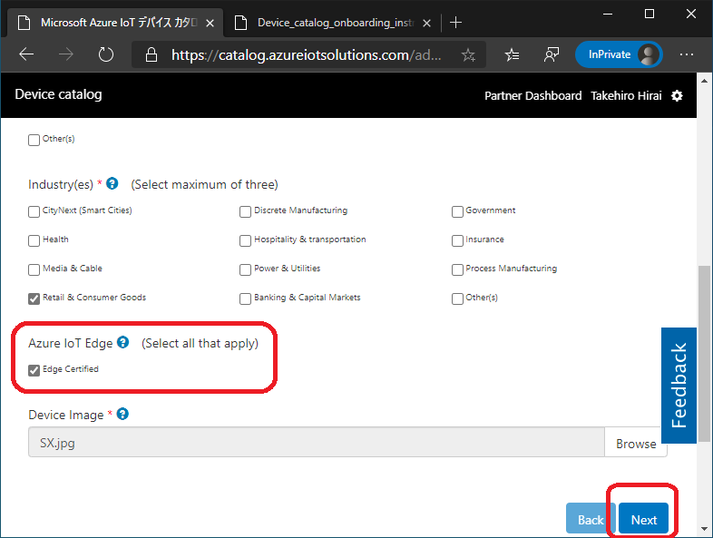
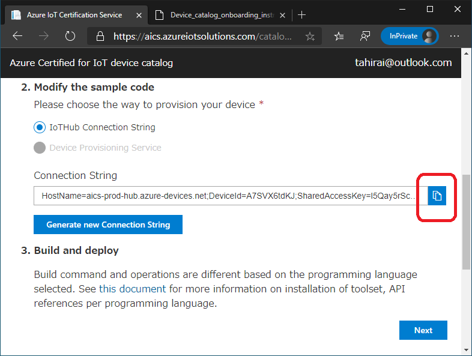
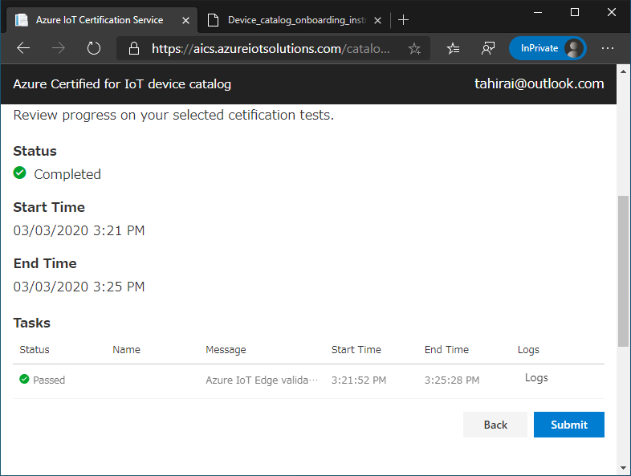
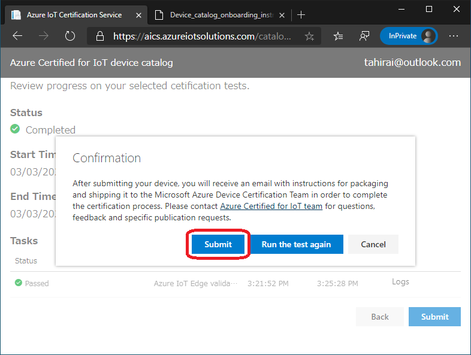

# Windows - Azure IoT Edge device certification. 

This document aims to give you a high level overview, instruction for how to take Azure IoT Edge certification by Windows 10 or Windows Server device.

## Step 1 – Prepare environment 

### reference environment:
* Windows 10 IoT Enterprise 2019 LTSC (17763) / AMD64 / en-us  
older or newer version is not expected. almost same instruction for Server 2019.  
latest cumulative update is installed (like 2020-02 KB4532691.)
* connected to Interet via Wi-Fi
* Remote Desktop is enabled. (if do via remote)

## Step 2 – Install/Initialize IoT Edge 
1. Open **Windows PowerShell (Admin)**
2. Run command (installation)  
    ```powershell
    . {Invoke-WebRequest -useb https://aka.ms/iotedge-win} | Invoke-Expression; `
    Deploy-IoTEdge
    ```
    it may ask reboot after running command, in that case, please reboot.  
  
3. Run command (initialization)
    ```powershell
    . {Invoke-WebRequest -useb https://aka.ms/iotedge-win} | Invoke-Expression; `
    Initialize-IoTEdge
    ```
    the command will stop by  
    > *cmdlet Initialize-IoTEdge at command pipeline position 1*  
    > *Supply values for the following parameters:*  
    > *DeviceConnectionString:*  
      
    please keep it as so, then go to next step.
    
## Step 3 – Start AICS (Azure IoT Certification Service)
1. Open **Azure Certified for IoT Device Catalog, Parter Dashbard**  
    [**https://catalog.azureiotsolutions.com/devices**](https://catalog.azureiotsolutions.com/devices)  
  
2. **General**, Click **Submit a New Device**, then fill in all required fields, like  
    *Device Name, Description, Device Type, Industry(es), Device Image*  
3. Check on **Edge Certified**, and click **Next**  

      

4. **Certification**, fill in all required fields (at least) again as below, then click **Next**  
    *Language, Cloud Protocol*  
  
5. **Connectivity**, fill in all required fields (at least) again as below, then click **Next**  
    *Tested Built-in Sensors, Hardware Interfaces (I/O), Connectivity*  
  
6. **Technical**, fill in all required fields (at least) again as below, then click **Next**  
    *CPU, Memory (RAM), Device Tech Spec URL(external), and so on*  
  
7. **Marketing**, fill in all required fields (at least) again as below, then click **Next**  
    *Device Marketing Page, Sales Contact, and so on*  
  
    if any missing, or wrong data on required field, cannot go **Next**, go back there and fix.

8. Copy **Connection String** from the page

      

    once copied, please go back to **PowerShell**.

## Step 4 – Finalize IoT Edge (cont. Step 2)
1. Copy **Conection String** to **PowerShell**, then press **Enter**  
    once done, type **Get-Service iotedge** then check output.  (Running or not) 
    > *Running | iotedge | Azure IoT Edge Daemon*  
    
    **TIPS:**  
    type **iotedge list** to confirm which module is running.  
    type **Get-IoTEdgeLog** to confirm the log for iotedge runtime itself.  
    type **iotedge logs edgeAgent** to confirm iotedge agent.  
      
    after confirming **Running**, go back to **AICS**.  

## Step 5 – Finalize AICS (cont. Step 3)
1. Click **Next** to start. it will take some minutes.  
2. once done successfully, you can see **Status** as **Completed**  
      
3. Click **Submit**, **Confirmation** is displayed, if ok, click **Submit**  
      

    Click **OK**, then wait email from IoT Certification team.  
    if no problem for submission, device will be **pre-approved** and listed on catalog.

    **TIPS:**  
    in order to complete (make it as final approval), you have to finish the following step.  if not, the submission will be rejected in the feature.

## Step 6 - Prepare, Send instruction (as How to use Azure IoT Edge)

## Step 7 (Final Step) - Send Device to HQ

